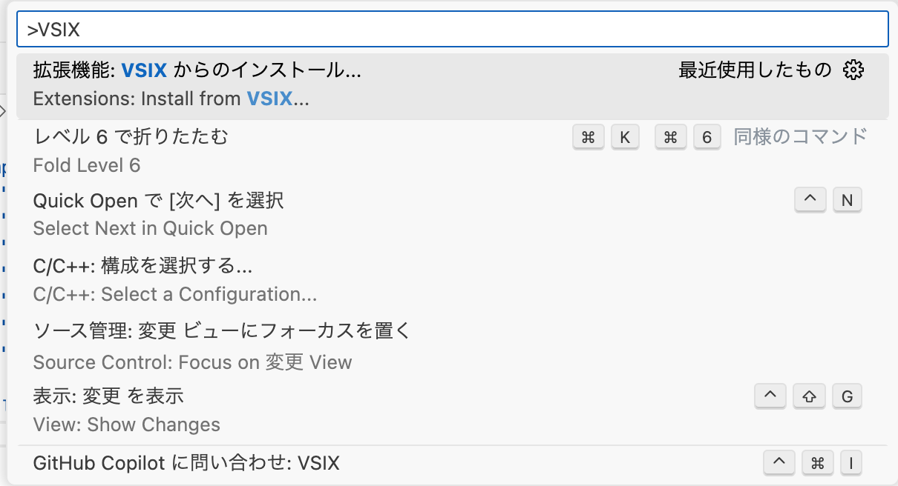
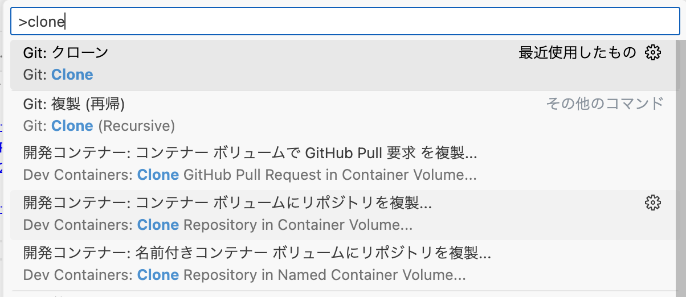
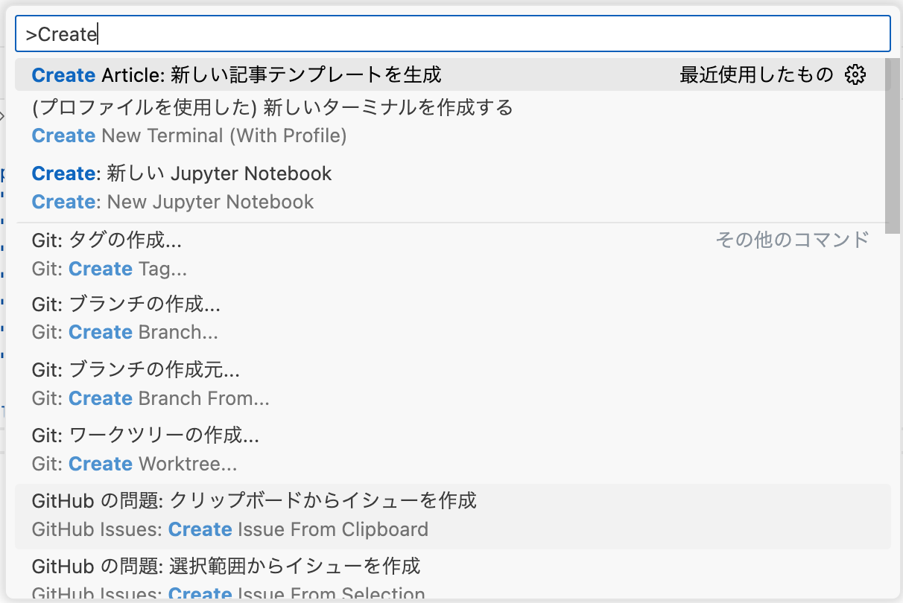
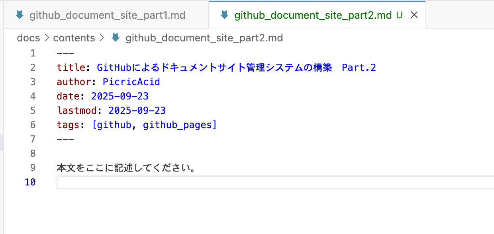
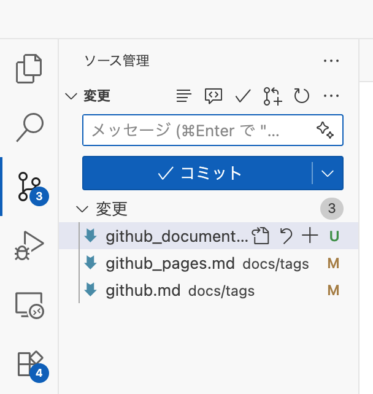
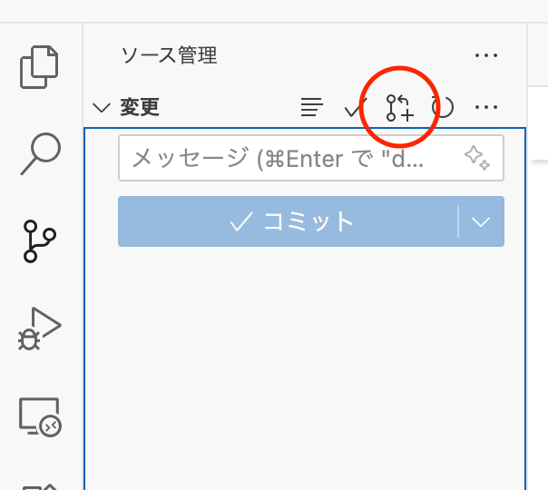

GitHub Pagesを用いたドキュメント公開システムの構築についての記事の第3回です。

前回まででドキュメントサイトの基本的な仕組みは整いました。ただし、タグの導入などにより記事の投稿手順が煩雑になっています。

現状記事を書く際には以下のようにしなければなりません。

1. 記事のタイトル、タグをfrontmatterに記載
2. 記事を書く
3. 記事に付与したタグに対してタグページを作成
	※ タグページはfrontmatterだけが書かれた空ファイル
4. commit、devブランチにpush
5. mainブランチへのPRを作成
6. PRを承認

特に面倒なのは3.です。内容もない空ファイルを作成する手順というのは、サイトの仕組みを知らない人からすれば、なんのためにやっているのかわからないでしょう。記載ミスも起こり得ます。

そこでこれらを自動化するVSCode拡張を作りましょう。

## VSCode拡張の仕様
上記のユースケースをもとに必要な機能を炙り出してみましょう。

1. 記事のタイトル、タグをfrontmatterに記載
	→記事のfrontmatterを自動で作りたい
2. 記事を書く
	→自動化できないが、書きながらMarkdownのプレビューが見たい
3. 記事に付与したタグに対してタグページを作成
	→　タグページ用のファイル作成、Frontmatter記載を自動で行いたい
4. commit、devブランチにpush
	→terminalでgitコマンドを叩くことなく、VSCode上で完結したい
5. mainブランチへのPRを作成
	→VSCode上で完結したい
6. PRを承認
	→管理者が行う作業のため自動化優先度は低い

2, 4, 5, 6についてはVSCodeの標準機能や、拡張を使うことで実現可能です。

| 番号   | ユースケース               | 拡張                                                                                                                      |
| ---- | -------------------- | ----------------------------------------------------------------------------------------------------------------------- |
| 2    | Markdownのプレビュー       | VSCodeの標準機能                                                                                                             |
| 4    | VSCode上でcommit, push | VSCodeの標準機能(PCにGitを導入している必要あり)                                                                                          |
| 5, 6 | PR作成、承認              | [GitHub Pull Request and Issues](https://marketplace.visualstudio.com/items?itemName=GitHub.vscode-pull-request-github) |

ということで、作成しなければいけないのは1, 3の機能です。
機能を細かく分割すると、
- 1-1.  記事のタイトル、タグ情報を入力から受け取る
- 1-2. 記事、タグページを作成する
- 1-3. Frontmatterを記載する

これを実装しましょう。

## VSCode拡張の作成
VSCodeはTypeScriptで簡単に作成できます。
以下のようなディレクトリ構成で作成します。

```
/
|-src/
|   |- extension.ts
|
|- package.json
|- tsconfig.json
```


`package.json`は以下のようにしました。

```json
{
	"name": "manual-site-extension",
	"displayName": "VSCode to ManualSite Extension",
	"description": "マニュアルサイト操作用のVSCode拡張機能",
	"version": "0.0.1",
	"engines": {
		"vscode": "^1.60.0"
	},
	"activationEvents": [
		"onCommand:extension.createArticleTemplate"
	],
	"main": "./out/extension.js",
	"contributes": {
	"commands": [
			{
				"command": "extension.createArticleTemplate",
				"title": "Create Article: 新しい記事テンプレートを生成"
			}
		]
	},
	"scripts": {
		"vscode:prepublish": "tsc -p ./",
		"compile": "tsc -p ./",
		"watch": "tsc -watch -p ./"
	},
	"devDependencies": {
		"@types/node": "^18.0.0",
		"typescript": "^4.4.3",
		"vscode": "^1.1.37"
	},
	"repository": {
		"type": "git",
		"url": "https://github.com/PicricAcid/manual-site-extension.git"
	}
}
```

ポイントは
```json
"contributes": {
	"commands": [
		{
			"command": "extension.createArticleTemplate",
			"title": "Create Article: 新しい記事テンプレートを生成"
		}
	]
}
```
の箇所です。ここにコマンドで実行する関数とタイトル(コマンドパレットに表示される)を記載します。また、`activationEvent`にも関数の記載が必要です(VSCodeは要らないと言ってきますが、ないとうまくいかないことがあります)。

`tsconfig.json`配下です。特に変わったことはしていません。
```json
{
    "compilerOptions": {
        "module": "commonjs",
        "target": "es6",
        "outDir": "out",
        "lib": ["es6"],
        "sourceMap": true,
        "rootDir": "src",
        "strict": true
    },
    "exclude": ["node_modules", ".vscode-test"]
}
```

最後に`extension.ts`として以下を記載します。

```typescript
async function createArticleTemplate() {
    const workspaceFolders = vscode.workspace.workspaceFolders;
    if (!workspaceFolders || workspaceFolders.length === 0) {
        vscode.window.showErrorMessage('ワークスペースが開かれていません。');
        return;
    }
    const root = workspaceFolders[0].uri.fsPath;

// 1-1. 記事のタイトル、タグ情報を入力から受け取る
    const title = await vscode.window.showInputBox({
        prompt: '記事のタイトルを入力してください',
        ignoreFocusOut: true,
    });
    if (!title) {
        vscode.window.showErrorMessage('タイトルが未入力のため中止します。');
        return; 
    }

    const author = await vscode.window.showInputBox({
        prompt: '著者名を入力してください',
        ignoreFocusOut: true
    });
    if (!author) {
        vscode.window.showErrorMessage('著者名が未入力のため中止します。');
        return;
    }
    
    const filename = await vscode.window.showInputBox({
        prompt: 'ファイル名(英数字・ハイフン・アンダーバーのみ)を入力してください(拡張子は自動生成されます)',
        ignoreFocusOut: true,
        placeHolder: 'example-article'
    });
    if (!filename || !/^[a-zA-Z0-9_-]+$/.test(filename)) {
        vscode.window.showErrorMessage('ファイル名が不正です。英数字、ハイフン、アンダーバーのみを使用してください。');
        return;
    }

    const tagInput = await vscode.window.showInputBox({
        prompt: 'タグ(スペース区切り, 空欄可)',
        ignoreFocusOut: true,
        placeHolder: 'tag1 tag2 tag3'
    });
    const tags = tagInput ? tagInput.trim().split(/\s+/) : [];

    const today = new Date().toISOString().slice(0, 10);

// 1-2. 記事、タグページを作成する
    const contentPath = path.join(root, 'docs', 'contents', `${filename}.md`);
    await fs.promises.mkdir(path.dirname(contentPath), { recursive: true });
    
    const tagDir = path.join(root, 'docs', 'tags');
    await fs.promises.mkdir(tagDir, { recursive: true });

// 1-3. Frontmatterを記載する
    const frontmatter = [
        `---`,
        `title: ${title}`,
        `author: ${author}`,
        `date: ${today}`,
        `lastmod: ${today}`,
        `tags: [${tags.map(tag => `${tag}`).join(', ')}]`,
        `---`,
        ``,
        `本文をここに記述してください。`,
        ``
    ].join('\n');
    
    await fs.promises.writeFile(contentPath, frontmatter, 'utf8');

    for (const tag of tags) {
        const tagFilePath = path.join(tagDir, `${tag}.md`);
        await fs.promises.writeFile(
            tagFilePath,
             `---\nlayout: tag\ntitle: ${tag}\ntag: ${tag}\n---\n`, 
             'utf8'
        );
    }

    vscode.window.showInformationMessage(`記事 "${title}" が作成されました: ${contentPath}`);
}  

export function activate(context: vscode.ExtensionContext) {
    context.subscriptions.push(
        vscode.commands.registerCommand('extension.createArticleTemplate', createArticleTemplate)
    );
}
```

前回まではFrontmatterにtitle, author, tagsを記載していましたが、ここにdate(記事作成日), lastmod(最終変更日)を追加しています。

注意すべき点としては、タイトル以外に記事のMarkdownのファイル名の入力を要求しているところです。タイトル名とファイル名を同じにすると、ファイル名では使えない文字が混入する場合があるため別にしています。ファイル名では英数字・ハイフン・アンダーバーのみの制限を加えています。

実際の処理は`createArticleTemplate()`にありますが、`activate()`でVSCodeのコマンドとして有効化を行なっています。

## VSCode拡張の有効化

### コンパイル、パッケージ化
作成したtypescriptをVSCodeで取り込める形式にコンパイルします。
VSCode拡張として取り込むには、VSIXパッケージという形式で出力する必要があるため、以下で作成します。

```shell
$ npx vsce package
```

実行すると`manual-site-extension-0.0.1.vsix`というファイルが作成されます。

### VSCode拡張のインストール
VSIX形式のVSCode拡張をインストールするには、コマンドパレットから「拡張機能:VSIXからのインストール」を実行します。ファイル選択画面になるので作成した.vsixファイルを選択します。



## VSCode拡張の使い方
作成したVSCode拡張の使い方は以下です。ユースケースに合わせてGitなどの拡張の使い方を含めた説明になります。

1. GitHubからドキュメントサイトのリポジトリをcloneします。
	コマンドパレットから「Git: クローン」を選択し、リポジトリのURLを入力します。
	

>[!NOTE]
>cloneは最初の一度だけで、2回目以降はFetchで差分を取得します。


2. 記事を作成します。
	コマンドパレットから「Create Article: 新しい記事テンプレートを作成」を選択します。
	タイトル、著者名、ファイル名、タグを入力します。
	記事のテンプレートとタグファイルが作成されるため、内容を記載します。
	
	

>[!TIP]
>記事を書く際はコマンドパレットの「Markdown: プレビューを開く」からプレビューを見ながら書くと便利です。
>

3. commit, pushします。
	コマンドパレットもしくはエディタ左のブランチバーから「コミット」を選択します。commitメッセージを入力し、チェックボタンを押すとcommitされます。さらに「変更の同期」で変更がpushされます。
	

>[!Warning]
>commitを行う前に、左下のブランチ表記からブランチをmainからdevに変更しておく必要があります。
>

4. PRを作成します。
	commit画面の右上のmergeマークからPRを作成します。
	

5. PRを承認します。
	承認はサイトの管理者が行います。

## まとめ
今回は誰でもドキュメントを投稿できるような補助システムを作成しました。この手のドキュメント・マニュアルサイトではより多くの人に使ってもらうことが肝要になるため、このような補助システムは積極的に作成し、最初の取り掛かりのハードルをなるべく下げましょう。

この記事ではVSCode拡張で機能を作成しましたが、GitHub Actionsを用いればIssueに書き込んだ内容を記事にすることも可能です。

次回が最終回になる予定です(ほんとに？)。次回ではこのドキュメントサイトに蓄積した知識をGitHub Copilotから活用するMCPサーバを作成します。

## 参考文献
- [VSCode拡張機能のつくり方](https://zenn.dev/suwash/articles/vscode_extension_20250523)


